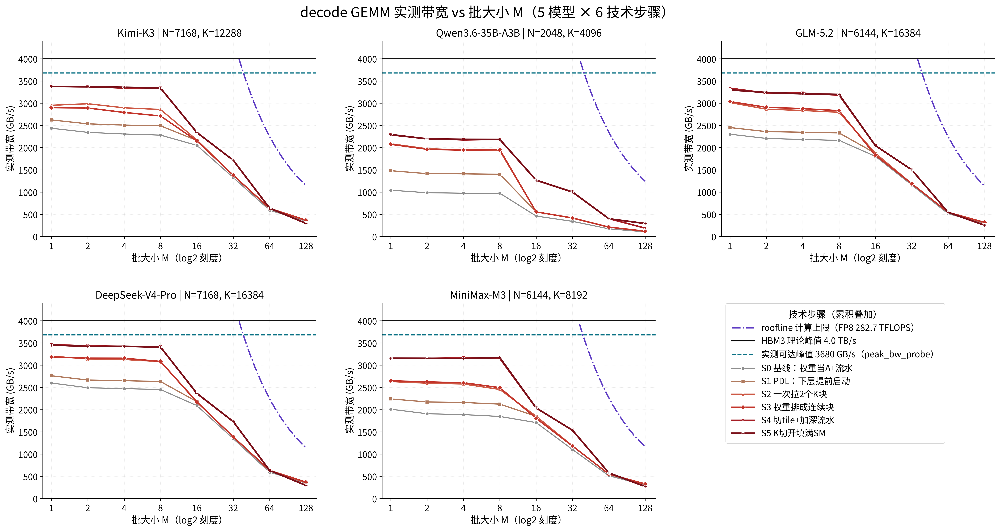

# decode_opt：H20 上把 decode GEMM 的带宽从 50% 调到 86.5%

## 这个项目在干什么

大模型每生成一个字（decode），每一层都要把整份权重矩阵从显存（HBM）读一遍。
读一份 117 MB 的权重，理论最快 29 微秒（117 MB ÷ 4.0 TB/s）。但实际 kernel 只能跑到
理论的 50-65%——因为这个 kernel 太短了（几十微秒），启动、预热、收尾的固定开销占比太大，
而且显存"同时能读多少路"也没喂饱。

本项目做了一件事：**把 6 个优化技术一个一个叠上去**，在 5 个真实模型的真实权重形状、
batch = 1 到 128 的全扫描下，测出每一步把带宽抬了多少。所有数字都是真机实测（H20，锁频），
每个数字都能追溯到 `results/` 里的 CSV。



*图：横轴 batch（1→128），纵轴实测带宽。黑实线 = 理论峰值 4.0 TB/s；青虚线 = 实测可达 3680 GB/s；
紫点线 = 计算屋顶（batch 大后曲线贴它下滑 = 变成计算瓶颈）。灰→红 = 六个技术逐步叠加。
每模型单图见 `results/fig_bw_vs_M_<模型>.png`。*

## 头条结果（batch=1 时的实测带宽，GB/s；括号 = 占理论峰值 4.0 TB/s 的百分比）

| 模型（权重形状 N×K） | ① 基线 | ② PDL | ③ 大块搬运 | ④ 权重重排 | ⑤ 切tile+深流水 | ⑥ K切分 |
|---|---|---|---|---|---|---|
| DeepSeek-V4-Pro (7168×16384) | 2598 (65%) | 2762 (69%) | 3202 (80%) | 3187 (80%) | **3462 (86.5%)** | 3454 (86%) |
| Kimi-K3 (7168×12288) | 2435 (61%) | 2623 (66%) | 2952 (74%) | 2899 (72%) | **3377 (84%)** | 3376 (84%) |
| GLM-5.2 (6144×16384) | 2301 (58%) | 2451 (61%) | 3014 (75%) | 3035 (76%) | **3336 (83%)** | 3298 (82%) |
| MiniMax-M3 (6144×8192) | 2009 (50%) | 2241 (56%) | 2631 (66%) | 2649 (66%) | 3152 (79%) | **3157 (79%)** |
| Qwen3.6 (2048×4096) | 1042 (26%) | 1480 (37%) | 2085 (52%) | 2074 (52%) | 2285 (57%) | **2294 (57%)** |

batch 从 1 到 128 的完整曲线见 `results/fig_main_bw_vs_M.png`（下图说明见 RESULTS.md）。

## 六个技术，用人话讲

| # | 名字 | 它在解决什么问题 |
|---|---|---|
| ① | 基线（swap-A/B + 流水） | 矩阵乘法指令固定一次算 64 行；decode 只有 1 行激活，直接算会浪费 98%。把**权重**塞进 64 行那一侧、激活放另一侧，就不浪费了。再用多级缓冲（流水）让搬运和计算重叠 |
| ② | PDL（让下一层提前启动） | 平时上一层 kernel 全部结束，下一层才能开始。H20 提供一条指令让 kernel 提前喊"我这边该搬的都搬上了，下一层可以进场了"，于是下一层的准备工作（建描述符、发第一笔搬运）和本层的收尾重叠掉。decode 是几十层串起来跑的，每层省一点，累积很大 |
| ③ | 一次搬更大的块（blockK） | 搬运指令一次搬 128 字节/行时，显存效率只有 ~38%；改成一次搬 256 字节/行（2 个 K 块），效率上到 ~80%。块越大越接近显存极限 |
| ④ | 权重重排（prepack） | 权重原始摆放是"一行一行"的，但 kernel 消费的是"一块一块"的矩形，每块在显存里碎成几十片。重排成"每块连续"后，搬运变成大块连续读。（实测：块已经够大时这步增益≈0，它的价值在块继续加大时才会体现，见 RESULTS.md） |
| ⑤ | 切 tile + 加深流水 | 78 个计算单元（SM）要喂饱：每块 tile 切多大决定同时有多少个 kernel 块在跑（96 块时 38% 的 SM 时间在等尾巴，128 块时降到 18%）；省下的显存空间用来加深流水（每路同时挂 3 笔搬运而不是 2 笔），把延迟藏住 |
| ⑥ | K 切分（split-K） | 当 tile 数不够填满 78 个 SM 时（小模型），把 K 维也切开凑数。**但只在"tile 不够且 kernel 够长"时赚**：小模型 batch=16/32 时 +44%/+39%，batch≤8 时反而 -16%（同步开销比赚的多）。适用域用实验钉死，见 `results/ablation_splitk_crossover.csv` |

### 关于 ② 的一个诚实细节（触发点放哪）

PDL 的"提前放行"信号是**按块（CTA）生效、先发的先算数**。我们测了三种放法
（`results/ablation_pdl_placement.csv`）：

| 触发点 | kimi batch=1 | qwen36 batch=1 |
|---|---|---|
| 搬运发完就喊（producer） | 27.02 µs | 4.58 µs |
| 喊两次（producer + 写回前） | 26.98 µs | 4.49 µs |
| 只在写回前喊（store） | 27.40 µs | 5.70 µs |

结论：**喊两次和喊一次完全一样**（先发先生效），**喊晚了会亏**（小 kernel 亏 25%）。
所以正确做法是"该搬的都搬上就立刻喊"；"写回前再喊一次"是冗余保险，不是新优化。

## 目录里每个文件是干什么的

```
README.md                 你正在看的这份说明
RESULTS.md                性能数字的完整解读：怎么测的、每条曲线怎么读、遗留问题
CONTRACT.md               接口冻结文档：kernel 的参数含义、CSV 每列含义、步骤定义（开发期的"宪法"）

kernels/decode_gemm.cuh   核心 kernel（~1000 行）。6 个技术全是编译期开关，一个文件全装下；
                          每个技术旁边有一段"为什么这么做"的注释
kernels/weight_prepack.cuh 权重重排：原始布局 / 连续块布局 两种 + 重排 kernel
kernels/sm90_compat.cuh   底层指令包装（矩阵乘 wgmma、屏障 mbarrier、共享内存描述符）
kernels/smoke_test.cu     正确性门禁：37 个配置 × 连发两次（抓"第二次才坏"的 bug）+ 对照参考
kernels/build_smoke.sh    编 smoke_test
kernels/run_smoke.sh      跑 smoke_test（自动走 GPU 安全调度）
kernels/README.md         kernel 的设计文档：模板参数表、共享内存/寄存器预算推导

bench/bench_decode.cu     测量主程序：三种计时协议、冷权重旋转、正确性对照、--tune 扫参
bench/bench_m8/16/32/64/128.cu  按 batch 档位拆开的编译单元（避免单文件编译爆炸，可并行编）
bench/bench_common.cuh    测量用的公共结构（CSV 行、计时统计）
bench/configs.cuh         "第几步用哪组参数"的映射表 + 扫参网格；每行带实测 GB/s 注释
bench/variant_impl.cuh    把每组参数实例化成可调用 kernel 的模板胶水
bench/kernel_api.h        kernel 对外接口的小封装
bench/json_min.h          极简 JSON 输出（不引第三方库）
bench/stub_kernel.h       开发期假 kernel（只用于流程自测，正式测量不用）
bench/Makefile            并行编译全部编译单元
bench/run_sweep.sh        一键全量扫描
bench/run_tune_campaign.sh / run_splitk_factor.sh  扫参 / split-K 路数扫描的脚本
bench/probe/*.cu          两个小探针：验证 PDL 启动属性用法、验证配置断言

tools/peak_bw_probe.cu    "显存到底能读多快"的诚实测量：6.98 GB 冷数据轮流读一遍，
                          杜绝缓存命中假象（历史上有人测出过 101% 峰值的假数据）
tools/gpurun_dg.sh        GPU 安全调度：挑空闲卡 + 跨项目锁 + 锁频 + 外来进程看门狗
tools/build_peak.sh / run_peak.sh  峰值探针的编译/运行
tools/README.md           峰值测量方法学：为什么这样测不会骗自己

analysis/plot.py          画图：带宽 vs batch 曲线族 + 理论峰值线 + 计算屋顶线
analysis/make_demo_csv.py 生成假数据自测画图脚本（真数据没到位时验证渲染）
analysis/README.md        图怎么读、每条线含义、字体策略

models/models.json        5 个模型的权重形状，每个数字带官方 benchmark 源码的行号证据
models/README.md          形状提取过程、踩过的坑（比如某模型权重是转置存的）

results/bench_v3_merged.csv        主数据：5 模型 × 6 步 × 8 个 batch × 3 协议 = 720 行
results/fig_main_bw_vs_M.png       主图（5 模型汇总）
results/fig_bw_vs_M_<model>.png    每模型单图
results/ablation_splitk_crossover.csv  split-K 赚/亏的边界实验
results/ablation_splitk.csv            split-K 开/关对照
results/ablation_pdl_placement.csv     PDL 触发点三放法对照
results/peak_bw.json                   实测可达峰值（3670.6 GB/s）及测量配置
results/baseline_cublaslt.csv          cuBLASLt 对照基线
```

## 怎么跑（H20 / SM90a / CUDA 12.8）

```bash
# 1. 正确性门禁（37 个配置，含"连发两次"回归检测）
cd kernels && ./build_smoke.sh && ./run_smoke.sh

# 2. 全量测量（5 模型 × 6 步 × batch 1..128 × 3 协议）
cd ../bench && make -j8
../tools/gpurun_dg.sh sweep ./bench_decode --models all --steps 0-5 --ms 1,2,4,8,16,32,64,128

# 3. 画图
/opt/conda/bin/python3 ../analysis/plot.py --csv ../results/bench_v3_merged.csv

# 4. 显存峰值参考线
../tools/gpurun_dg.sh peak ../tools/peak_bw_probe
```

## 测量口径（不骗人的三条铁律）

1. **权重必须是冷的**：准备 ≥512 MB 的权重副本轮流读（显存缓存只有 60 MB），
   保证每次读都是真读显存，不是读缓存。
2. **锁频**：1830 MHz（H20 能锁的上限），每批数据记录实际频率。
3. **三种计时都记**：单发（ISO）、连发 90 次（B2B）、连发+PDL（PDL）。
   曲线口径：第①步用 B2B、第②步起用 PDL——因为 PDL 本身就是第②步引入的技术。
   理论峰值线固定画 4.0 TB/s（显存规格），另加一条实测可达线 3670.6 GB/s。

## License

MIT
